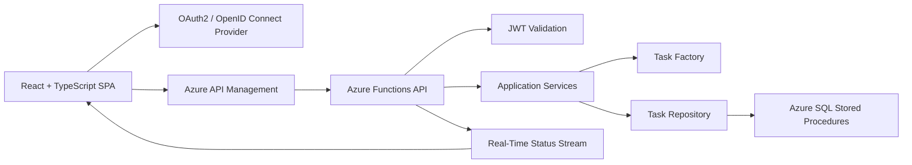
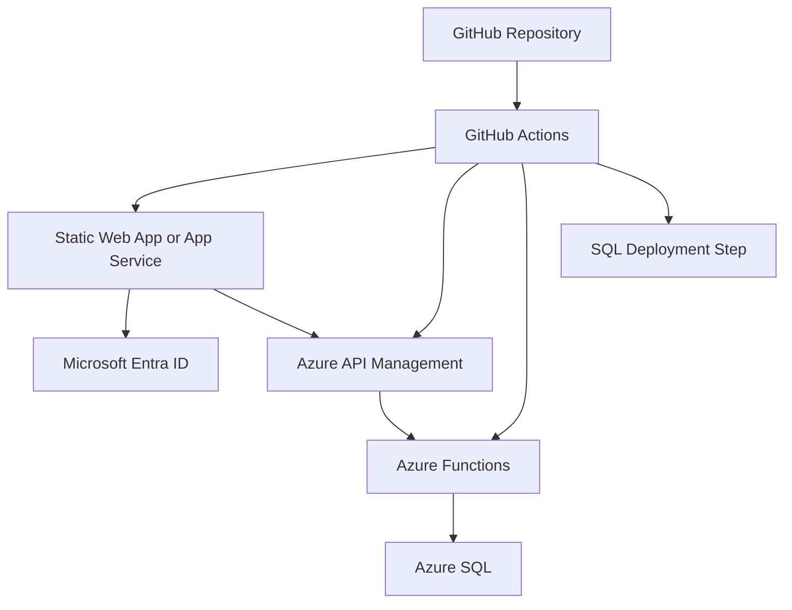

# Architecture

## Overview

This project is a full-stack task management application designed for Azure-native deployment. The architecture separates presentation, API orchestration, domain logic, persistence, authentication, and documentation so each layer can be developed and tested independently.



## System Context

- Users interact with a responsive React web application.
- Authentication is delegated to an OAuth2/OpenID Connect broker such as Microsoft Entra External ID, Azure AD B2C, Auth0, Firebase Auth, or Clerk.
- Microsoft, Google, and GitHub social providers are configured in the broker, not as separate backend password flows.
- The frontend sends JWT access tokens to the backend.
- Azure API Management exposes the public REST API facade.
- Azure Functions implement task operation endpoints behind API Management.
- Azure SQL stores task records and supports filtering through indexes and stored procedures.
- Swagger/OpenAPI documents the HTTP contract.

## Backend Architecture

The backend should be implemented as a C# Azure Functions project using dependency injection and async APIs throughout.

Recommended folder structure:

```text
api/
  Functions/
    Auth/
      LoginFunction.cs
      LogoutFunction.cs
      MeFunction.cs
      RegisterFunction.cs
    Tasks/
      CreateTaskFunction.cs
      DeleteTaskFunction.cs
      GetTaskByIdFunction.cs
      ListTasksFunction.cs
      UpdateTaskFunction.cs
      UpdateTaskStatusFunction.cs
      TaskStatusStreamFunction.cs
  Auth/
    AuthPrincipal.cs
    JwtOptions.cs
    JwtPrincipalReader.cs
  Domain/
    TaskItem.cs
    TaskStatus.cs
  Dtos/
    CreateTaskRequest.cs
    TaskResponse.cs
    TaskQuery.cs
    UpdateTaskRequest.cs
    UpdateTaskStatusRequest.cs
    Auth/
      AuthUserResponse.cs
      RegisterUserRequest.cs
  Factories/
    ITaskFactory.cs
    TaskFactory.cs
  Repositories/
    ITaskRepository.cs
    SqlTaskRepository.cs
    IUserRepository.cs
    SqlUserRepository.cs
  Services/
    IAuthService.cs
    AuthService.cs
    ITaskService.cs
    ServiceResponse.cs
    ServiceResponseStatus.cs
    TaskService.cs
  Errors/
    ErrorCatalog.cs
    ErrorDefinition.cs
    ServiceCodes.cs
  Program.cs
```

### Function Layer

Azure Function classes are responsible for HTTP concerns only:

- Route binding
- Reading and validating request bodies
- Reading the authenticated user
- Calling application services
- Returning HTTP responses

Function classes should not contain SQL logic or business rules.

### Service Layer

`TaskService` owns business workflows:

- Create a task for the authenticated user
- Enforce allowed status transitions
- Normalize query filters
- Verify that the caller can access a task
- Coordinate repository operations
- Return a standard `ServiceResponse<T>` envelope for success and known errors

`AuthService` owns application auth workflows after the external identity provider has issued a valid token:

- Login/upsert the local user profile
- Register or update application profile fields
- Load the current user profile
- Return logout acknowledgement while token/session clearing happens in the frontend and identity provider

### Repository Layer

`SqlTaskRepository` is the only component that talks to Azure SQL. It should call stored procedures with parameterized commands and return domain objects or DTO projection models.

`SqlUserRepository` owns user-profile persistence and never stores passwords.

### Factory Pattern

`TaskFactory` centralizes creation of valid task domain objects. This avoids scattering defaults such as `Pending` status, timestamps, and ownership rules across function handlers.

### Dependency Injection

`Program.cs` should register:

```csharp
builder.Services.Configure<JwtOptions>(configuration.GetSection("Jwt"));
builder.Services.AddSingleton<IJwtPrincipalReader, JwtPrincipalReader>();
builder.Services.AddScoped<ITaskFactory, TaskFactory>();
builder.Services.AddScoped<IUserRepository, SqlUserRepository>();
builder.Services.AddScoped<IAuthService, AuthService>();
builder.Services.AddScoped<ITaskService, TaskService>();
builder.Services.AddScoped<ITaskRepository, SqlTaskRepository>();
```

## Authentication and Authorization

The API uses OAuth2/OpenID Connect access tokens issued by a trusted identity broker. The broker can federate Microsoft, Google, and GitHub social login behind one issuer/audience configuration.

JWT validation should verify:

- Issuer
- Audience
- Signature
- Expiration
- Required scope or role

The application should use stable subject claims for ownership:

- `ExternalId`: `sub`, `oid`, or `nameidentifier` claim
- `createdBy`: subject claim of the user who created the task
- `assignedTo`: subject or email of the assigned user

The backend does not implement username/password authentication. `/auth/register` stores only the local application profile linked to the external identity.

Authorization rule:

- Users can read tasks they created or are assigned to.
- Users can update or delete tasks they created.
- Assigned users can update task status.

## Data Architecture

Recommended table:

```sql
CREATE TABLE dbo.Tasks
(
    Id UNIQUEIDENTIFIER NOT NULL CONSTRAINT PK_Tasks PRIMARY KEY,
    Title NVARCHAR(200) NOT NULL,
    Description NVARCHAR(2000) NULL,
    DueDate DATETIME2 NULL,
    Status NVARCHAR(20) NOT NULL,
    CreatedBy NVARCHAR(200) NOT NULL,
    AssignedTo NVARCHAR(200) NULL,
    CreatedAt DATETIME2 NOT NULL,
    UpdatedAt DATETIME2 NOT NULL,
    RowVersion ROWVERSION NOT NULL
);
```

User profiles:

```sql
CREATE TABLE dbo.Users
(
    Id UNIQUEIDENTIFIER NOT NULL CONSTRAINT PK_Users PRIMARY KEY,
    ExternalId NVARCHAR(200) NOT NULL UNIQUE,
    Email NVARCHAR(320) NULL,
    DisplayName NVARCHAR(200) NULL,
    Provider NVARCHAR(60) NOT NULL,
    CreatedAt DATETIME2 NOT NULL,
    UpdatedAt DATETIME2 NOT NULL,
    RowVersion ROWVERSION NOT NULL
);
```

Recommended indexes:

```sql
CREATE INDEX IX_Tasks_CreatedBy_Status_DueDate ON dbo.Tasks (CreatedBy, Status, DueDate);
CREATE INDEX IX_Tasks_AssignedTo_Status_DueDate ON dbo.Tasks (AssignedTo, Status, DueDate);
CREATE INDEX IX_Tasks_Status_DueDate ON dbo.Tasks (Status, DueDate);
```

Stored procedures should cover:

- `dbo.User_Upsert`
- `dbo.User_GetByExternalId`
- `dbo.Task_Create`
- `dbo.Task_GetById`
- `dbo.Task_List`
- `dbo.Task_Update`
- `dbo.Task_UpdateStatus`
- `dbo.Task_Delete`

Filtering should remain server-side to keep the frontend fast and avoid over-fetching.

## API Design

The API follows REST conventions and returns JSON. Public traffic should enter through Azure API Management, which forwards requests to Azure Functions.

```text
Public base URL: https://<apim-name>.azure-api.net/api
Function base URL: https://<function-app>.azurewebsites.net/api
```

```text
GET    /api/tasks
GET    /api/tasks/{id}
POST   /api/tasks
PUT    /api/tasks/{id}
PATCH  /api/tasks/{id}/status
DELETE /api/tasks/{id}
GET    /api/tasks/stream
POST   /api/auth/login
POST   /api/auth/logout
POST   /api/auth/register
GET    /api/auth/me
```

All JSON API responses use the same envelope:

```json
{
  "data": {},
  "code": "TASK_RETRIEVED",
  "status": "ok",
  "message": "Task retrieved successfully."
}
```

Known errors use the same shape:

```json
{
  "data": null,
  "code": "TASK_NOT_FOUND",
  "status": "error",
  "message": "Task was not found."
}
```

Common HTTP response codes:

- `200 OK`: successful read or update
- `201 Created`: successful create
- `200 OK`: successful delete with an empty success envelope
- `400 Bad Request`: validation failure
- `401 Unauthorized`: missing or invalid token
- `403 Forbidden`: valid token without access to the task
- `404 Not Found`: task does not exist or is not visible to the caller

## Real-Time Updates

The first implementation can use Server-Sent Events for task status changes:

- The frontend opens `/api/tasks/stream` with an access token.
- The API emits status-change events.
- The frontend updates local task state when an event arrives.

For production scale, move this responsibility to Azure SignalR Service so updates work across multiple Function instances.

## Frontend Architecture

Recommended structure:

```text
client/src/
  __generated__/
    client/
    hooks/
    types.ts
  configs/
    api.ts
  features/
    auth/
      components/
      config/
      providers/
    tasks/
      components/
        TaskForm.tsx
        TaskFilters.tsx
        TaskList.tsx
        TaskStatusBadge.tsx
      hooks/
        useTasks.ts
        useTaskStatusStream.ts
      pages/
        TaskManagementPage.tsx
      utils/
        query.ts
      types.ts
  routes/
    AppRoutes.tsx
  stores/
    taskStore.ts
  styles/
    styles.css
  utils/
```

Frontend principles:

- Use React Router data routes with page-level lazy loading.
- Export route page modules with `Component` so they can be lazy-loaded directly by the router.
- Use Kubb-generated React Query hooks from `src/__generated__` through the `@api/*` alias.
- Keep task orchestration in `features/tasks/hooks/useTasks.ts`.
- Keep authentication state in `react-auth-kit`, wrapped by the local `useAuth()` facade.
- Use Zustand only for focused local UI/query state.
- Use react-hook-form for form validation.
- Show clear loading, empty, and error states.
- Keep layouts responsive for mobile and desktop.

## Error Handling

Backend:

- Keep known application errors in `ErrorCatalog` so codes/messages are consistent across services and functions.
- Return `ServiceResponse<T>` from application services with `{ data, code, status, message }`.
- Map service envelopes to HTTP status codes in the Azure Function boundary.
- Keep authentication errors in the security/function boundary through `IJwtPrincipalReader`.
- Log unexpected exceptions with correlation IDs.
- Avoid leaking database or token-validation internals to clients.

Frontend:

- Show inline validation errors near form fields.
- Show API errors in dismissible alerts.
- Retry task loading only for transient failures.

## Testing Strategy

Backend unit tests use xUnit and Moq:

- Service tests mock `ITaskRepository`.
- Function tests mock `ITaskService` and authenticated user readers.
- Repository integration tests can run against a local SQL container when available.

Frontend tests should cover:

- Required field validation
- Filter controls
- Empty and loading states
- API error rendering
- Status update behavior from the real-time stream

## Deployment View



## Security Decisions

- Never store tokens in long-lived local storage if the auth library supports safer browser storage.
- Validate JWTs on every protected API request.
- Use parameterized SQL commands and stored procedures.
- Keep connection strings and client secrets outside source control.
- Restrict CORS to known frontend origins.
- Return `404` instead of `403` when revealing task existence would leak data.

## Future Enhancements

- Azure SignalR Service for production-grade real-time updates
- Azure API Management policies for JWT validation, rate limiting, and backend protection
- Azure Search for advanced search
- Redis for hot task-list caching
- Additional Bicep modules for production network isolation and Key Vault references
- Playwright E2E coverage
- Audit log table for task history
